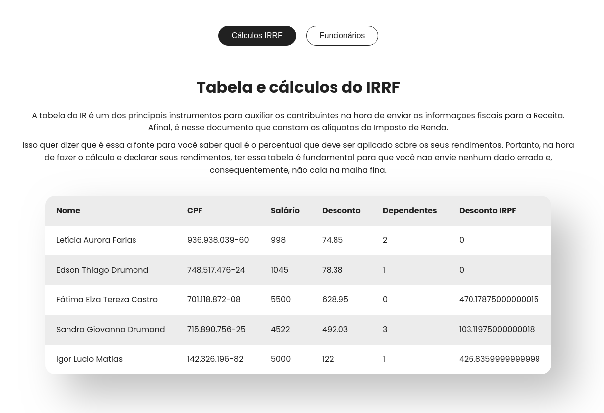
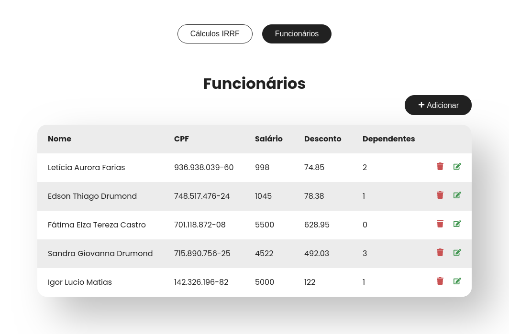
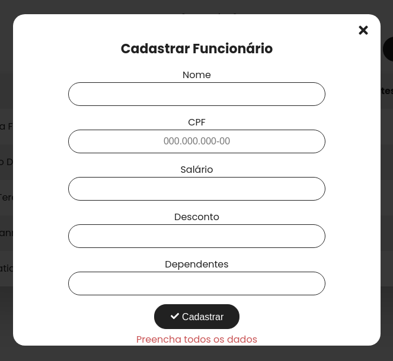
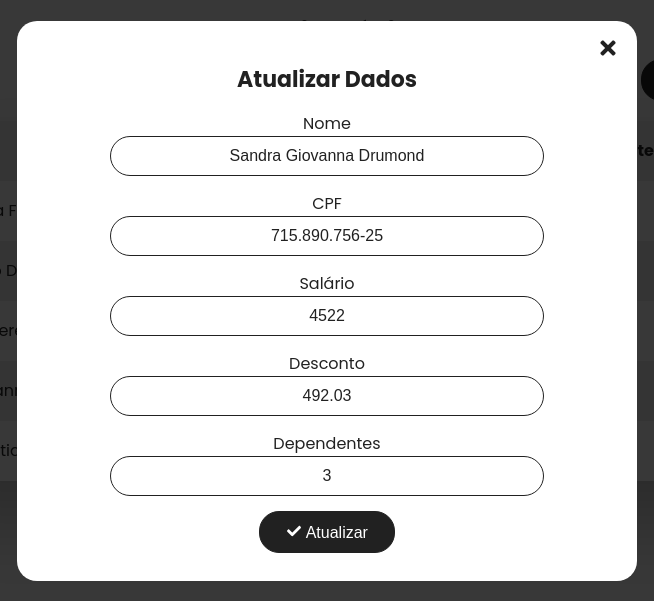

# Teste Técnico Prático - SEIDOR

## Tópicos
* [Capturas de Tela](#capturas-de-tela)
* [Executar o projeto](#executar-o-projeto)

## Capturas de tela
<p align='center'>  
  
  
 
</p>
 
  

## Executar o projeto
```bash
# Clone este repositório.
$ git clone https://github.com/gom-mota/teste_seidor.git

# Acesse a pasta do projeto no terminal/cmd.
$ cd teste_seidor

# Instale as dependências.
$ npm install

# Iniciar o projeto em modo de desenvolvimento.
$ npm start

# irá abrir uma página no navegador.
```